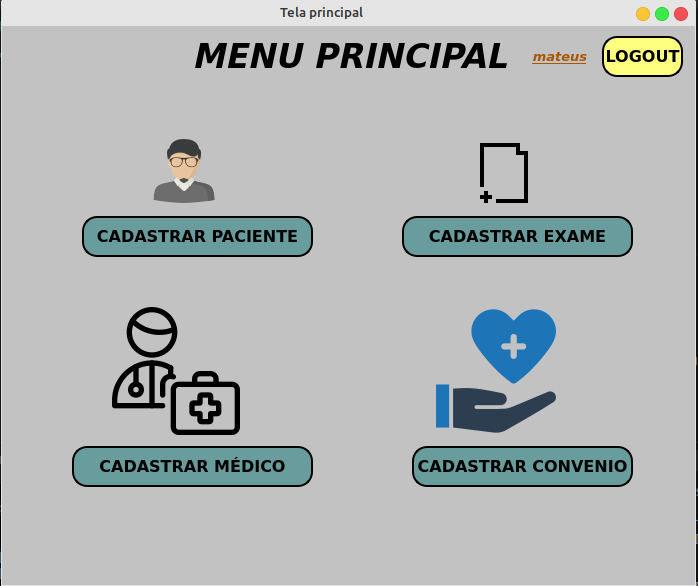
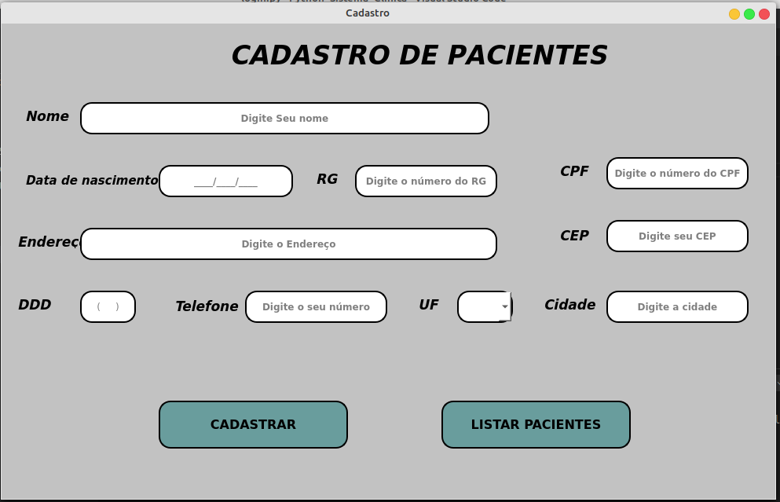
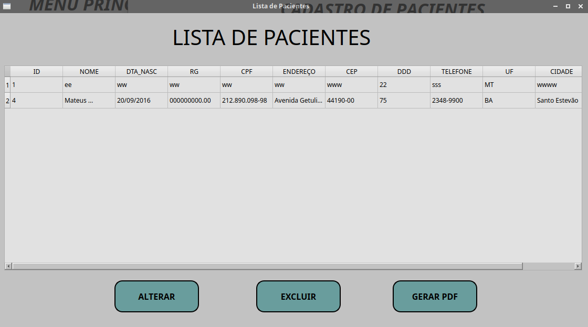

# SISTEMA CLINICA MÉDICA

Este sistema consiste em realizar as operações de um CRUD, baseado numa analise de requisitos de uma clinica médica que desea informatizar seus processos de gerenciamento. O sistema faz Cadastro, lista os pacientes já cadastrados, edita os dados, exclui um paciente e também gera um pdf com lista de pacientes.

## Objetivo

Este programa é por em prática váriops conceitos fundamentais da linguagem Python, como: Interface gráfica, métodos, listas, banco de dados entre outros, geração de pdf...

## Tecnologias

`Obs: É necessário ter um ambiente de desenvolvimento Python instalado em sua máquina.`

- [Python 3.8](https://www.python.org/downloads/)

- [VsCode](https://code.visualstudio.com/download)

- [Biblioteca PyQt5](https://pypi.org/project/PyQt5/)

- [Biblioteca Reportlab](https://pypi.org/project/reportlab/)

## Screenshots

## Licença

Este projeto está sob a licença MIT.

## Autor

Mateus Souza de Jesus, formado em Analise e Desenvolvimento de Sistemas, pelo Centro Universitário Leonardo da Vinci. Estudo a linguagem Python, e também ciência de dados.
